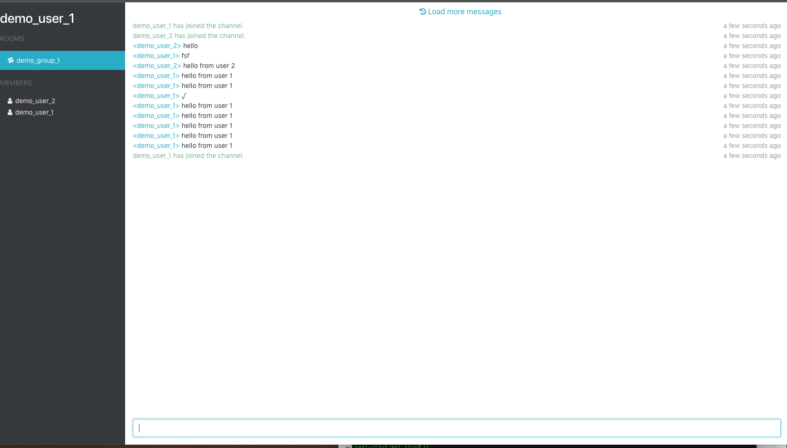

# rtm-redis

A real-time messaging system that uses Redis Streams for chatting and Redis Graph to build the social graph.

## Requirements

Docker and Docker Compose installed.

## Usage

**Launch the example using Docker**

    docker-compose up -d

After the containers have been built, the example can be accessed by navigating to http://localhost:3000/

**Remove containers**

    docker-compose rm -f

### Postman Collection
[Check it here](postman_collection.json)

### Screen shot
